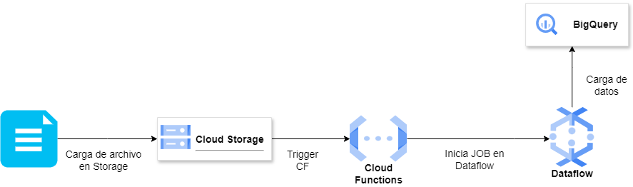



# NYC Taxis & Carbon Emission 🚕 

### `Contexto`

En un mundo cada vez más consciente de la importancia de la sostenibilidad y la reducción de la contaminación ambiental, una nueva empresa de taxis está decidida a tomar medidas significativas. Su enfoque se centra en la inversión de vehículos eléctricos como una forma de reducir las emisiones de dióxido de carbono (CO2) y, al mismo tiempo, buscar beneficios económicos mediante la eficiencia de costos.

Para lograr este objetivo, la empresa ha recurrido a nuestra consultora. La misión es evaluar exhaustivamente los datos relacionados con la operación de taxis, las emisiones de CO2 y las tendencias del mercado de vehículos eléctricos. Este análisis permitirá a la empresa tomar decisiones informadas que contribuyan a la reducción de la contaminación y, al mismo tiempo, maximizar sus beneficios económicos.

A través de la exploración de datos y el análisis de tendencias, esperamos aportar soluciones significativas que beneficien tanto a la empresa como al medioambiente.

## 🚀 `¿Quiénes somos?`

DATA INSIGHT solutions es una consultora especializada en análisis, ciencia e ingeniería de datos, dedicada a potenciar decisiones estratégicas que maximicen las ganancias de nuestros clientes. Con un compromiso inquebrantable hacia la excelencia y el perfeccionismo en los detalles, hemos liderado proyectos exitosos en diversos sectores.

Impulsados por nuestra visión de un futuro más sostenible y alineados con las tendencias del mercado, exploramos activamente la relación entre los datos y las oportunidades de negocio. Nuestra misión es proporcionar insights valiosos que permitan a las empresas tomar decisiones informadas y rentables.

En DATA INSIGHT solutions contamos con un equipo de profesionales especializados en análisis de datos, machine learning y tecnologías cloud. Nos dedicamos a desbloquear el potencial de los datos para que empresas, como la tuya, avancen hacia el futuro con confianza y éxito.

# Descripción 📝
Este proyecto tiene como objetivo examinar cómo los taxis y los servicios de viaje compartido influyen en la emisión de carbono en la ciudad de Nueva York. A través del análisis de datos relacionados con el tráfico y las emisiones de CO2, buscamos identificar soluciones sostenibles que permitan disminuir la huella de carbono de estos servicios. Además, evaluaremos la viabilidad de incorporar una flota de taxis en la ciudad de Nueva York como parte de las medidas para lograr una mayor sostenibilidad ambiental.

# 'Alcance' 📝
Este proyecto tiene como alcance examinar cómo los taxis y los servicios de viaje compartido influyen en la emisión de carbono en la ciudad de Nueva York. A través del análisis de datos relacionados con el tráfico y las emisiones de CO2, buscamos identificar soluciones sostenibles que permitan disminuir la huella de carbono de estos servicios. Además, evaluaremos la viabilidad de incorporar una flota de taxis en la ciudad de Nueva York como parte de las medidas para lograr una mayor sostenibilidad ambiental.
    

### `Objetivos`
- **Formular** una propuesta de proyecto a partir del análisis del tema y de los datos disponibles.
- **Cordinar** de manera efectiva para aprovechar las fortalezas individuales y lograr sinergia en el desarrollo de productos de datos.
- **Completar** tareas críticas para avanzar según el plan en todas las etapas del proyecto.
- **Producir** entregables tangibles e intangibles que reflejen el progreso y el logro de objetivos específicos a lo largo del desarrollo.

# KPIs

## Enfoque Operativo: 🚗

El enfoque operativo se centra en optimizar la eficiencia y la rentabilidad de la flota de transporte de pasajeros.

### AHORRO DE COSTOS OPERATIVOS EN FLOTA DE TAXIS

- Definición: Medir el ahorro porcentual en costos operativos (combustible, mantenimiento, autonomía, etc) al utilizar vehículos eléctricos en lugar de vehículos de combustión interna durante el primer año.
- Objetivo temporal: Reducir un 15% en costos operativos en el primer año de implementación de vehículos eléctricos.
- Fórmula: ((Costos operativos de la flota de taxis con vehículos de combustión interna - Costos operativos de la flota de taxis con vehículos eléctricos) / Costos operativos de la flota de taxis con vehículos de combustión interna) * 100.

## Enfoque Ambiental: 🌳

Este enfoque pretende reducir el impacto ambiental de la flota de transporte de pasajeros y evaluar la viabilidad de la transición a vehículos eléctricos.

### REDUCCIÓN DE EMISIONES DE CARBONO EN FLOTA DE TAXIS

- Definición: Medir la disminución porcentual de las emisiones de carbono durante un año, al utilizar vehículos eléctricos en lugar de vehículos de combustión interna.
-  Objetivo temporal: Lograr una reducción del 30% en las emisiones de carbono en un año al cambiar a vehículos eléctricos.
-  Fórmula:  ((Emisiones de carbono de la flota de taxis con vehículos de combustión interna - Emisiones de carbono de la flota de taxis con vehículos eléctricos) / Emisiones de carbono de la flota de taxis con vehículos de combustión interna) * 100.

### DISMINUCIÓN DE CONTAMINACIÓN SONORA EN FLOTA DE TAXIS

-  Definición: Reducir la contaminación sonora en la flota de vehículos eléctricos en comparación con los de combustión, utilizando la velocidad promedio como indicador y estimando la emisión de presión sonora por tipo de vehículo.
-  Objetivo temporal: Reducir 50 % el nivel de presión sonora acumulado en los horarios de congestión para la flota de vehículos eléctricos en comparación con los de combustión. 
-  Fórmula:  ((Emisiones acústicas de la flota de taxis con vehículos de combustión interna - Emisiones acústicas de la flota de taxis con vehículos eléctricos) / Emisiones acústicas de la flota de taxis con vehículos de combustión interna) * 100.

## Enfoque Financiero: 📈

Evaluar la rentabilidad y la viabilidad financiera de la transición a vehículos eléctricos.

### REDUCCIÓN DE TIEMPO DE RETORNO DE INVERSIÓN (ROI)

- Definición: Determinar el período de tiempo necesario para recuperar el costo de adquisición de vehículos eléctricos en flota de taxis, a través de los ahorros en combustible y mantenimiento, en un plazo máximo de tres años.
- Objetivo temporal: Lograr un tiempo de retorno de la inversión en vehículos eléctricos menor a 3 años, proyectando el resultado económico/financiero del análisis de viajes de taxis del último año.
- Fórmula: Costo total del vehículo eléctrico / Ganancias netas anuales.

# Stack tecnológico

- Python 
- Pandas 
- Numpy 
- Matplotlib 
- Seaborn 
- TensorFlow 
- Apache Airflow 
- Power BI 
- Flask 
- Google Cloud Platform (GCP) 
- Streamlit 

# Workflow Pipeline ETL

# Autores:

## Data science:

- Leandro Adrian Britez
- Alejandro Huanca Jarro

## Data Analysis:

- Marie Fernanda Lopez Bello
- Luciana Carolina Chutte

## Data Engineering:

- Alan Joel Guevara

